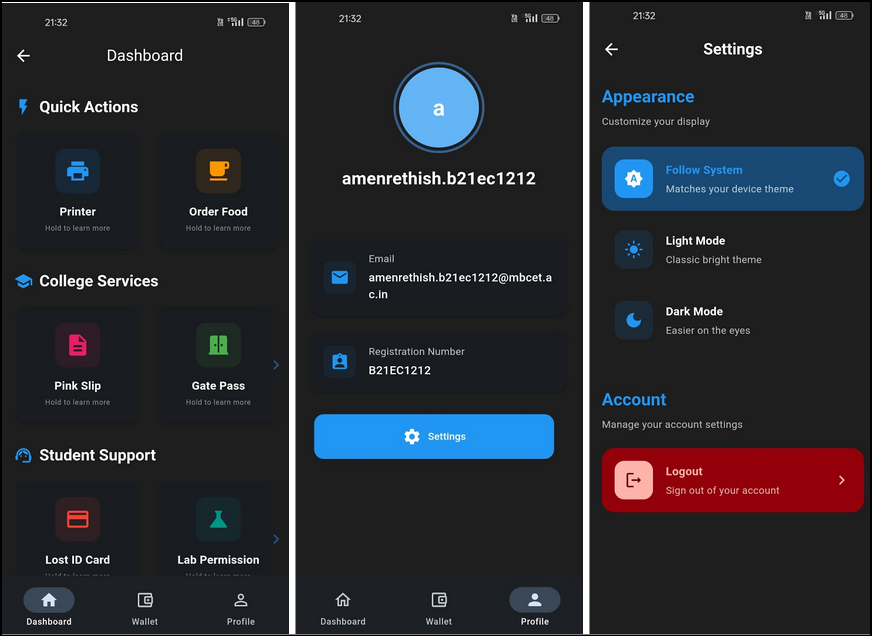
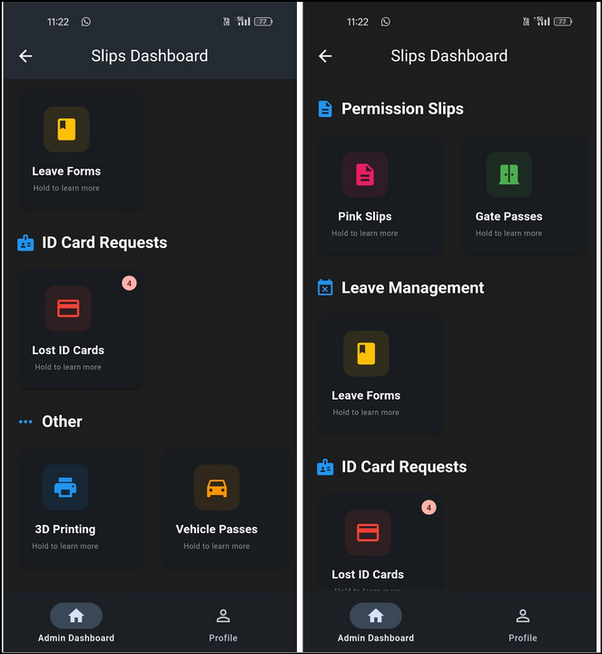

# 🎓 Campus Services Management System (CSMS)

A comprehensive mobile application to streamline and digitize various college services.

## 🌟 Key Features

<table>
  <tr>
    <td>💳 <b>Digital Wallet</b><br/>Secure payments & transactions</td>
    <td>🖨️ <b>Print Services</b><br/>Document printing with QR tracking</td>
    <td>🚗 <b>Vehicle Pass</b><br/>Digital pass management</td>
  </tr>
  <tr>
    <td>🎫 <b>ID Cards</b><br/>Lost card replacement system</td>
    <td>🏢 <b>Lab Access</b><br/>Permission & booking system</td>
    <td>🤖 <b>Smart Vending</b><br/>QR-based purchases</td>
  </tr>
</table>

## 📱 Screenshots

<table>
  <tr>
    <td></td>
    <td></td>
  </tr>
</table>

## 🚀 Quick Start

1. Set up [websockets](https://github.com/xditya/csms-notifs/) & [appwrite](https://appwrite.io/)
2. Clone & install:
```bash
git clone https://github.com/xditya/CampusServicesManagementSystem
flutter pub get
```
3. Configure `.env` and run:
```bash
flutter run
```

## 🔗 Related Projects
- [Websockets](https://github.com/xditya/csms-notifs)
- [Vending API](https://github.com/xditya/csms-api)
- [Hardware (ESP32, ESP32CAM)](https://github.com/xditya/csms-hardware)

---

<div align="center">
  <table>
    <tr>
      <td align="center"></td>
      <td align="center"></td>
      <td align="center"></td>
    </tr>
  </table>
</div>
